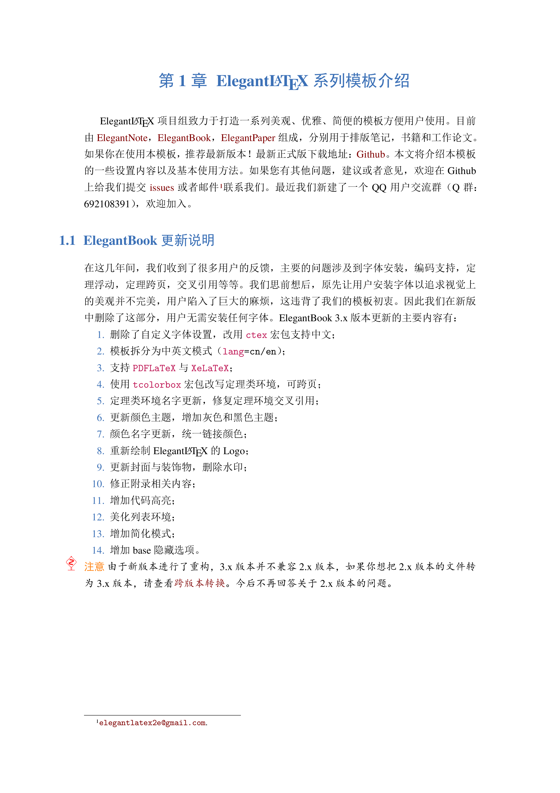
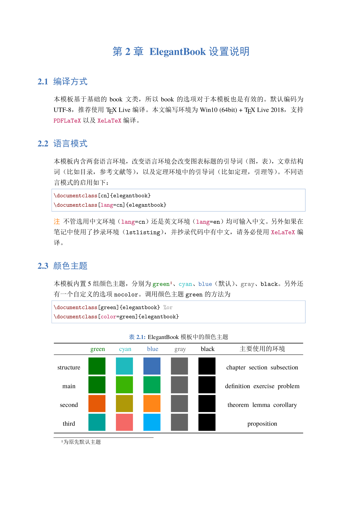
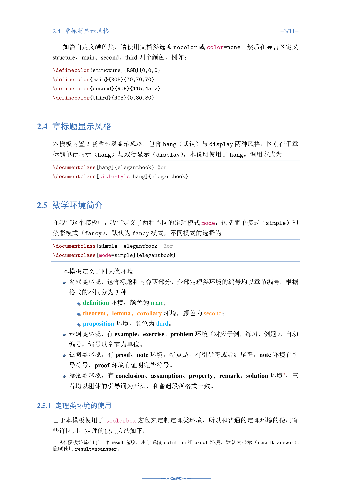
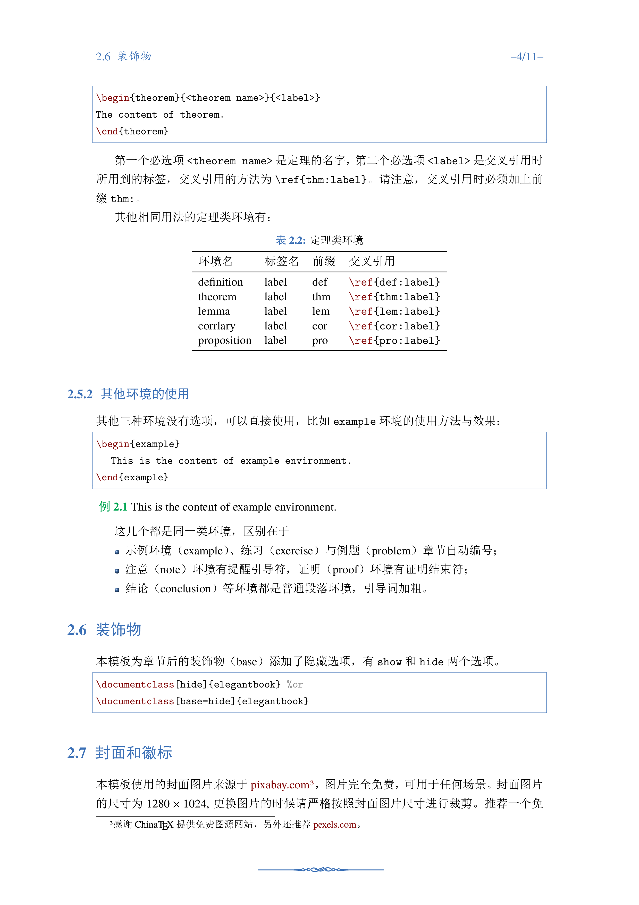
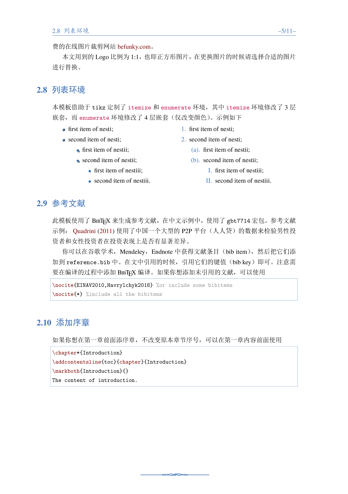
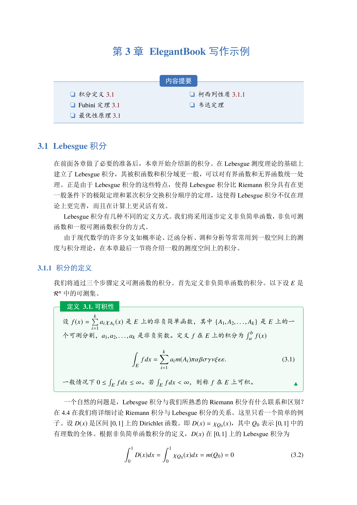
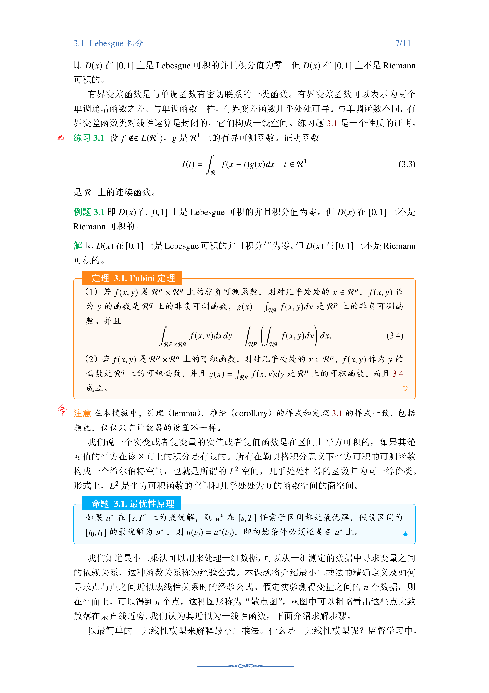
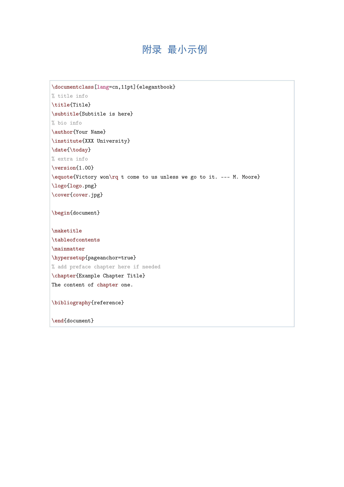

    

---

### Target

[ElegantBook](https://github.com/ElegantLaTeX/ElegantBook) 书籍模版的 bookdown 扩展

### TO DO

- [ ] 制作封面，注意此封面只在生成 PDF 时出现
- [ ] 首先在bookdown下完美复现原 LaTeX 模版的功能
- [ ] 运行跑通 Gitbook/PDF 输出
- [ ] 各个 block 转自定义的 sidebar 借助 Pandoc 和 Lua 实现的 Pandoc filters
   1. Pandoc 提供的 [divs-and-spans](https://pandoc.org/MANUAL.html#divs-and-spans) [自定义block原型实现](https://github.com/yihui/bookdown-crc/issues/1#issuecomment-449198568)
   1. bookdown 提供的定理等环境自定义 [custom-blocks](https://bookdown.org/yihui/bookdown/custom-blocks.html)
- [ ] 各个 block 的 CSS 定制，提示、警告等图标
- [ ] 各个 note warning 块的定制，也是一种 block 可由 Pandoc filters 实现
- [ ] 各种代码块语法高亮的定制和 knitr 提供的语法高亮，最好单独抽出来
- [ ] 基于 Pandoc 提供的 LaTeX 模版还是 rmarkdown 内置的 LaTeX 模版？应该自定义一份极小的补充 ElegantBook 模版的文档
- [ ] 是保持 Pandoc 模版尽量不动，还是保持 ElegantBook 模版不动？
- [ ] 参考 [bookdown-crc](https://github.com/yihui/bookdown-crc) 和 [bookdown-chinese](https://github.com/yihui/bookdown-chinese) 的设计

### 致谢

1. [ElegantBook](https://github.com/ElegantLaTeX/ElegantBook) 开发者
1. [bookdown](https://github.com/rstudio/bookdown) 开发者
1. [Pandoc](https://pandoc.org) 开发者
